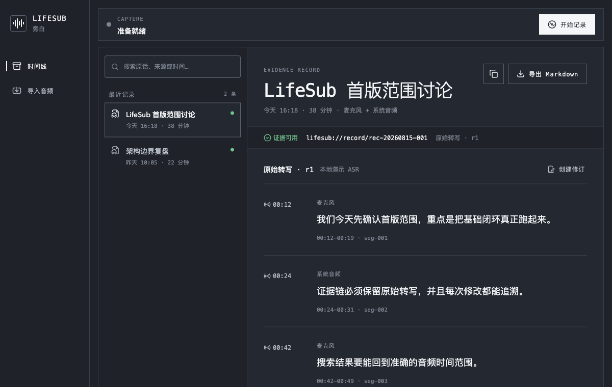

# LifeSub / 旁白

> 把持续发生的声音，可靠地保存为可定位、可审计、可被上层系统引用的证据。

LifeSub（中文名：旁白）是一个本地优先的长时音频与 ASR 证据管理系统。它负责采集、音频分片、转写 revision、Markdown 投影、基础检索与来源定位，让“谁在什么时候说了什么，原始音频和文本在哪里”始终可以被验证。

**当前阶段：V0.1 Evidence 闭环已完成 · V0.2 真实本地 ASR 已完成实现与验证**



## 为什么是 LifeSub

录音工具通常只负责采集，会议产品通常只保留一次转写，知识工具则倾向直接给出总结。LifeSub 选择把中间缺失的 Evidence 层做好：

- **可靠保存**：原始音频先落盘，派生处理失败不破坏来源。
- **不可变修订**：原始 ASR 与后续校对形成 append-only revision，不静默覆盖历史。
- **精确定位**：文本、时间范围、音频来源和 Provider 处理记录保持关联。
- **本地优先**：默认在用户设备上处理；未来云端能力必须单独授权并明确数据去向。
- **开放组合**：下游通过稳定 Evidence Ref 读取获授权内容，而不是直接访问数据库。

LifeSub 不负责跨记录记忆压缩、项目理解或长期知识治理，也不把模型推断伪装成原始证据。

## 当前可用能力

V0.1 已形成一个可运行的纵向闭环：

| 能力 | 当前状态 |
|---|---|
| React + Tauri 桌面应用壳 | 已实现 |
| Capture Session 开始、暂停、恢复、停止状态机 | 已实现 |
| 音频文件导入、SHA-256 hash、本地不可变副本 | 已实现 |
| SQLite Evidence Catalog | 已实现 |
| append-only Transcript Revision 与人工修订 | 已实现 |
| 中文关键词检索、时间线与记录详情 | 已实现 |
| `lifesub://` Evidence URI 解析 | 已实现 |
| 可再生 Markdown 导出 | 已实现 |
| Provider、隐私和数据位置状态展示/设置入口 | 已实现 |
| 浏览器演示模式与 Tauri 桌面写入模式 | 已实现；历史数据重载界面待完善 |
| 真实本地 SenseVoice / Whisper ASR | V0.2 已实现 |
| ScreenCaptureKit + AVAudioEngine 原生双路采集 | 待实现 |

当前内置的是确定性演示 ASR Provider，用于验证完整 Evidence 流程，不应被视为真实模型转写。桌面版已能将会话、导入音频和 revision 写入本地 Catalog，但当前时间线仍从演示数据初始化，应用重启后的历史 Evidence 重载界面尚待完善。当前检索和导出针对界面中已加载的记录可用。

### V0.2 真实本地 ASR

V0.2 已实现 SenseVoiceSmall 与 Whisper 可切换的真实离线转写：

- **运行时**：sherpa-onnx 1.13.5 静态链接，无 Python Sidecar，无云端依赖。
- **模型**：SenseVoiceSmall INT8 (163 MB)、Whisper Tiny (116 MB)、Whisper Base (208 MB)、Whisper Small (639 MB)，全部本地处理。
- **模型管理**：SHA-256 校验下载、安全解压、版本化安装、可恢复、可删除。
- **ASR Job**：单例 worker 锁、租约、boot ID 隔离、claim-generation fencing、取消、有界重试。
- **Revision**：成功结果原子发布 Receipt + Revision + Segment + FTS；重转写追加新 revision，不覆盖历史。
- **设置**：Provider 切换、模型卡片、语言、线程、VAD、自动转写、ITN/任务控制。
- **接受度**：通过桌面验收场景（heartbeat、cancel、recovery、packaged-smoke）。

详细设计见 [`docs/superpowers/specs/2026-08-15-lifesub-real-asr-design.md`](docs/superpowers/specs/2026-08-15-lifesub-real-asr-design.md)。

截至 **2026-08-18** 的验证快照：前端单元测试 6/6、Rust 单元测试 6/6、Playwright 验收 1/1，Vite 生产构建与 Tauri desktop feature 编译通过；arm64 DMG 已完成本地 checksum 与 `.app` bundle 签名验证。该产物不是公开 Release，也不代表已完成 Apple notarization。

## 快速开始

### 环境与支持范围

- Node.js + npm，需满足 Vite 7 的运行要求。
- 支持 Rust 2024 edition 的稳定 Rust 工具链。
- 构建桌面应用需要 Tauri 2 对应的平台依赖。
- 当前产品与已验证安装包聚焦 macOS Apple Silicon；浏览器演示模式可用于界面与流程预览。
- V0.2 的首发验证目标为 macOS 14+ Apple Silicon，Intel 不作为该版本发布 Gate。

### 浏览器演示

```bash
npm install
npm run dev
```

浏览器预览使用内置演示数据，可体验录音状态、搜索、revision、导出和设置。

### Tauri 桌面版

```bash
npm run tauri -- dev --features desktop
```

桌面模式使用本地 SQLite Catalog 和应用数据目录写入导入的音频副本与 Evidence 数据；当前版本尚未把已落盘的历史记录重新加载到时间线。

### 验证项目

```bash
npm test
npm run build
npm run test:e2e
cargo test --manifest-path src-tauri/Cargo.toml --no-default-features
SHERPA_ONNX_ARCHIVE_DIR="$(scripts/fetch-sherpa-runtime.sh)" cargo test --manifest-path src-tauri/Cargo.toml --features asr-runtime
SHERPA_ONNX_ARCHIVE_DIR="$(scripts/fetch-sherpa-runtime.sh)" cargo test --manifest-path src-tauri/Cargo.toml --features desktop commands_test
SHERPA_ONNX_ARCHIVE_DIR="$(scripts/fetch-sherpa-runtime.sh)" cargo check --manifest-path src-tauri/Cargo.toml --features desktop
cargo fmt --manifest-path src-tauri/Cargo.toml --check
cargo clippy --manifest-path src-tauri/Cargo.toml -- -D warnings
```

### 真实模型 Gate

```bash
# 下载并验证模型后运行
LIFESUB_ASR_MODEL_DIR="$HOME/Library/Application Support/com.goldenwave.lifesub/models" \
  scripts/verify-asr-gate.sh
```

### 桌面验收

```bash
LIFESUB_ASR_MODEL_DIR="$HOME/Library/Application Support/com.goldenwave.lifesub/models" \
  scripts/verify-desktop-asr.sh target
```

### DMG 构建与验证

```bash
SHERPA_ONNX_ARCHIVE_DIR="$(scripts/fetch-sherpa-runtime.sh)" \
  npm run tauri -- build --features desktop
otool -L src-tauri/target/release/bundle/macos/LifeSub.app/Contents/MacOS/lifesub
codesign --verify --deep --strict --verbose=2 src-tauri/target/release/bundle/macos/LifeSub.app
scripts/verify-desktop-asr.sh dmg
```

## 架构

### V0.1 已实现

```text
React / TypeScript UI
        │ Tauri commands
        ▼
Rust Evidence Core
  ├── Capture Session 状态机
  ├── Audio import + SHA-256
  ├── SQLite Catalog / 中文检索
  ├── Transcript Revision
  ├── Evidence URI
  └── Markdown Renderer
        │
        ├── 本地对象副本
        └── 可再生 Markdown
```

核心对象包括 `CaptureSession`、`AudioChunk`、`TranscriptRevision` 和 `TranscriptSegment`。原始来源与不可变 revision 是证据链核心；Markdown 和索引是可重建派生数据。

### 目标架构

目标架构是在同一个本地 Evidence Core 周围增加薄客户端与平台适配器：

- **macOS Capture Adapter**：ScreenCaptureKit 采集系统音频，AVAudioEngine 采集麦克风，来源默认分开保存。
- **ASR Pipeline**：V0.2 使用统一 sherpa-onnx Rust 运行时接入 SenseVoiceSmall 与 Whisper。
- **Evidence Contract**：向 Malow、Codex 等获授权消费者提供版本化引用和状态解析。
- **Multi-Device Reconciler**：V0.3 对齐多设备录音、标记重叠与冲突，并生成新的不可变合并 revision。

完整设计见[系统架构](docs/architecture.md)。其中规划目录与未来组件是设计意图，不代表当前仓库已经全部实现。

## 路线图

### V0.2：真实本地 ASR

V0.2 已完成 PRD、技术设计和实施计划，下一步进入 TDD 实现：

- SenseVoiceSmall 与 Whisper 可切换的真实离线转写。
- 统一 sherpa-onnx Rust 运行时，无 Python Sidecar。
- 模型下载、SHA-256 校验、安装、切换和删除。
- 可恢复 ASR Job、Provider Receipt、带时间戳 Segment 与重新转写。
- 新结果追加为 revision，永不覆盖既有转写。

V0.2 **不接入云端 ASR**。在本地模型链路稳定后，后续版本会增加可选云端 Provider；云端处理必须独立显式授权、展示数据去向、记录模型与输入 hash，并与本地 Provider 使用一致的 revision 和审计语义。

### 后续阶段

- macOS 菜单栏手动长时录制与系统音频/麦克风双路采集。
- 不可变、有界、可恢复的 Physical Audio Chunk。
- 按时间戳、静音、长度和录制状态形成 Logical Transcript Segment，不做主题级语义切分。
- 通过 FTS5 按时间、来源、设备和文本关键词检索。
- V0.3 多设备时间校准、重复消除、ASR 冲突标注和合并 revision。
- 版本化 Evidence Contract、访问授权、撤回、删除与审计。
- 移动 companion、外部录音设备和加密对象同步。

GitHub 不作为全天音频与转写的主存储或同步通道。

## 生态关系

LifeSub、[malow / 吗喽](https://github.com/TheGoldenWave/malow) 与 [GoldenWave](https://github.com/TheGoldenWave/goldenwave) 组成一条解耦链路：**LifeSub 保存发生过什么，Malow 判断这对当前工作意味着什么，GoldenWave 治理什么值得长期相信和复用。**

| 项目 | 职责 | 权威数据 |
|---|---|---|
| LifeSub | 录音、音频与文本分片、ASR revision、Markdown 投影、检索和证据授权 | Capture Session、Audio Chunk、Transcript Revision、Transcript Segment、Evidence Ref |
| Malow | 在 Project / Matter 中引用证据，整理主题、决定、行动项和候选内容，并提供人工 Review | Project、Matter、Conversation、Organizer Result、Knowledge Patch Draft |
| GoldenWave | 接收人工确认的 Knowledge Patch，执行验证、冲突、新鲜度、敏感度、渲染与 Git 审计 | Profile、Knowledge、Persona、正式 Project Context 与治理历史 |

```text
LifeSub Evidence
  -> Malow Organizer / Human Review
  -> user-confirmed Knowledge Patch
  -> GoldenWave Inbox / Governance
```

三个项目保持独立源码仓库、数据库和发布节奏，不共享 SQLite。下游只保存稳定的 Evidence Ref、hash、授权范围和必要快照，不得直接读取 LifeSub 数据库。LifeSub 不直接生成或写入 GoldenWave 正式知识。

## 明确不做

- 跨记录记忆压缩、人物关系和长期事实推断。
- 决定、行动项、项目状态或 Knowledge Candidate 的权威抽取。
- Profile、Persona、Knowledge 或正式 Project Context。
- Malow Project / Matter / Organizer / Agent Run 状态。
- 直接生成或修改 GoldenWave 正式知识。

## 项目文档

- [产品定义](docs/product-brief.md)
- [V0.1 PRD](docs/prd/lifesub-v0.1/PRD.md)
- [V0.2 真实本地 ASR PRD](docs/prd/lifesub-real-asr-v0.2/PRD.md)
- [Evidence Platform 产品与技术架构设计](docs/superpowers/specs/2026-08-15-lifesub-evidence-platform-design.md)
- [系统架构](docs/architecture.md)
- [Evidence API 与集成](docs/integrations.md)
- [隐私、权限与同步](docs/privacy-and-sync.md)
- [阶段路线图](docs/roadmap.md)
- [决策记录](docs/decisions.md)
- [Design System](design.md)
- [Logo 与 macOS 菜单栏呈现决策](docs/design/lifesub-logo-decision.md)

## 数据与仓库边界

本仓库是公开的产品与代码仓库，不存放任何真实录音、转写、声纹、Evidence、密钥或用户配置。真实数据必须保存在用户选择的本地数据目录，或未来明确设计的加密对象同步空间中，不得提交到本仓库。

## License

许可证尚未确定。在许可证明确之前，不授予复制、修改或分发本仓库内容的许可。
