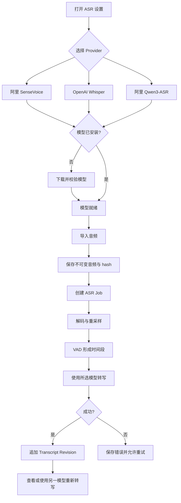
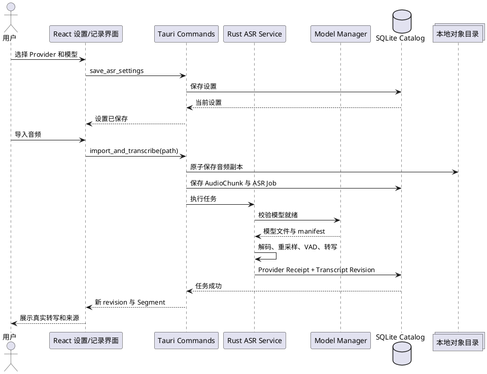

# PRD - LifeSub 真实本地 ASR V0.2

## 1. 业务目标

| 维度 | 内容 |
|---|---|
| 项目名称 | LifeSub 真实本地 ASR V0.2 |
| 目标用户 | 在 macOS 本机保存、转写和检索个人音频证据的 LifeSub 用户 |
| 核心价值 | 使用可切换的真实本地模型生成可定位、可追溯、可重转写的 Transcript Revision |
| 成功指标 | SenseVoice、Whisper、Qwen3-ASR 0.6B 与 Qwen3-ASR 1.7B 均完成真实样本转写；两档 Qwen 使用各自固定运行时且绝不互相回退；设置切换、模型管理、自动转写和重转写流程通过验收 |
| 预估用户量级 | 本地单用户桌面应用，不涉及服务端并发 |
| 预计上线 | 设计与真实模型 Gate 通过后发布 V0.2 |

## 2. User Journey Map

| 阶段 | 用户目标 | 用户操作 | 系统反馈 | 关键风险 |
|---|---|---|---|---|
| 初次配置 | 准备一个可用模型 | 打开设置，选择 Provider 和模型并下载 | 展示大小、许可、进度、校验和就绪状态 | 下载中断、空间不足 |
| 日常导入 | 将音频转成 Evidence | 导入本机音频 | 保存不可变副本并创建 ASR Job | 格式不支持、模型未就绪 |
| 查看结果 | 确认转写来源与时间 | 打开记录详情 | 展示 Segment、Provider、模型、revision 和处理状态 | 占位文本被误认为真实结果 |
| 模型比较 | 使用另一模型重新识别 | 切换设置并点击重新转写 | 创建新 revision，保留旧结果 | 静默覆盖历史结果 |
| 故障恢复 | 处理失败任务 | 查看错误并重试 | 使用原参数或当前参数重新排队 | 静默回退、错误不可诊断 |

## 3. 业务流程图

## 4. 前后端交互时序

## 5. 功能模块

### 5.1 ASR Provider 与设置

#### 5.1.1 切换 Provider 和模型

**功能概述**: 用户在设置页选择 SenseVoice、Whisper 或 Qwen3-ASR，以及该 Provider 下的具体模型。

**前置条件**: LifeSub 桌面版已启动，SQLite Catalog 可写。

**操作步骤**:

1. 用户进入设置页的 ASR 区域。
2. 用户通过分段控件选择“阿里 SenseVoice”“OpenAI Whisper”或“阿里 Qwen3-ASR”。
3. 用户从模型卡列表中选择一个已安装模型，或下载未安装模型。
4. 用户保存设置。

**预期结果**:

1. 设置页展示当前 Provider、模型、语言支持、包体大小、许可证和安装状态。
2. Provider 切换后只展示兼容模型和参数。
3. 未安装模型不能成为可执行配置；下载与 structural install 完成仍可能是 `installed_unqualified`，只有所需 runtime qualification 完成后才标记为就绪。
4. 设置保存后，新 ASR Job 使用该配置；已存在的 revision 不变化。

**异常情况**:

| 异常场景 | 系统响应 |
|---|---|
| 当前 Provider 没有已安装模型 | 保存配置但标记为“等待模型”，自动转写任务进入 blocked_model 状态 |
| 模型文件缺失或 hash 不一致 | 标记模型损坏，禁止执行并提供重新下载 |
| 设置保存失败 | 保留原设置，显示可诊断错误，不更新界面中的生效状态 |

**业务规则与数据约束**:

- Provider 枚举仅允许 `sense_voice`、`whisper` 与 `qwen3_asr`。
- Provider 与模型 ID 必须来自内置、版本化 Model Manifest。
- 不允许静默回退到另一 Provider 或另一模型。
- 默认 Provider 为 SenseVoice，前提是对应模型已就绪；否则状态为待安装，不伪造成功。

#### 5.1.2 调整识别参数

**功能概述**: 用户配置语言、线程数、VAD 及模型专属参数。

**前置条件**: 已选择 Provider 和模型。

**操作步骤**:

1. 用户选择自动语言检测或 Provider 支持的具体语言。
2. 用户调整线程数。
3. 用户开启或关闭 VAD。
4. SenseVoice 用户设置 ITN；Whisper 用户选择 transcribe 或 translate；Qwen3-ASR 0.6B 固定使用自动语言检测，Qwen3-ASR 1.7B 可选择自动检测或 manifest 明确支持的固定语言。
5. 用户保存设置。

**预期结果**:

1. 不支持的参数不会显示或提交。
2. 设置被持久化，并完整复制到新任务的 Provider Receipt。
3. 关闭 VAD 时仍生成覆盖完整音频范围的 Segment；开启时按语音区间生成 Segment。

**异常情况**:

| 异常场景 | 系统响应 |
|---|---|
| 线程数超出范围 | UI 限制输入，Core 再次校验并拒绝非法值 |
| 指定语言不受模型支持 | 阻止保存并提示可选语言 |
| Whisper translate 与非 Whisper Provider 组合 | Core 返回 invalid_provider_parameter |
| Qwen3-ASR 0.6B 提交显式语言 | Settings 与 Core 均返回 invalid_provider_parameter；不得把 language 改写成 hotwords 或运行时 metadata |

**业务规则与数据约束**:

- 线程数为整数，范围 `1..=max(1, logical_cpu_count)`，默认不超过 4。
- SenseVoice 支持 auto、zh、en、ja、ko、yue。
- Whisper runtime 语言值只能是 `auto` 或 manifest 声明且 sherpa Whisper 接受的具体语言代码；`multilingual` 仅描述模型能力，不是可提交的 runtime language，必须从可选值、Job 参数和 Receipt 中删除。
- Qwen3-ASR 0.6B 的 sherpa `OfflineQwen3ASRModelConfig` 没有 language 字段，因此 V0.2 只允许 `auto`；显式语言必须在 Settings/Core 边界返回 `invalid_provider_parameter`，也不得写入 `hotwords`。
- Qwen3-ASR 1.7B 的 Candle adapter 可把 `auto` 映射为 `TranscribeOptions.language = None`，并把 manifest 支持的具体语言映射为 crate 接受的规范英文语言名；未知代码或模型不支持的语言返回 `invalid_provider_parameter`。
- VAD 默认开启；V0.2 将 sherpa-onnx `1.13.5`（commit `3dc7c569f31ca2cd4a20ed6f7db780327e6714c5`）源码默认值冻结为版本化 manifest：`threshold = 0.5`、`min_silence_duration = 0.5 s`、`min_speech_duration = 0.25 s`、`max_speech_duration = 20 s`、`window_size = 512` samples、`sample_rate = 16000 Hz`、`num_threads = 1`、`provider = "cpu"`。来源为 `sherpa-onnx/csrc/silero-vad-model-config.h` 与 `sherpa-onnx/csrc/vad-model-config.h`；高级参数不在首版开放。
- LifeSub 的 `200 ms` speech padding 与最长 `25 s` 窗口/硬切策略属于音频分段编排，不属于 Silero VAD model config，也不得写入 VAD manifest 冒充上游默认值。该上限按送入 Provider 的已 padding 窗口计算：在 16 kHz 单声道工作样本上分别固定为 `3,200` 与 `400,000` samples，任何窗口加上实际左右 padding 后都不得超过 `400,000` samples。
- 进入编排器的 detector core 集合必须至少包含一个非空 core，按 `start` 排序，全部位于音频范围内且互不重叠；乱序、空 core、越界或 overlap 必须拒绝。core 之间允许有 gap；恰好相邻的 detector cores 不合并，分别保留为独立 Evidence utterance。
- 长核心语音区间按半开样本范围 `[start, end)` 确定性切分。每轮先判断剩余 core 加实际边界 padding 是否已能完整放入一个 Provider 窗口；能放入即作为尾段，否则以当前窗口允许的最晚安全 core boundary 为目标，在其前后 `2 s` 搜索区间经安全边界裁剪后，仅检查绝对 20 ms 网格上的候选。候选使用以边界为中心的 20 ms mean-square energy，最低能量胜出，完全相同则取最早边界；没有候选时在最晚安全 boundary 硬切。所有样本算术必须 checked，候选必须严格推进 cursor，禁止空窗口、溢出或死循环。
- padding 只作为 inference context。VAD core 及长 core 切分后的相邻 core evidence ranges 必须无缝覆盖原 core、单调且不重叠，不能因左右 padding 扩大 Evidence 时间范围。VAD 关闭时 Evidence 仍是覆盖完整音频的单一 utterance；超过 25 秒的音频只在内部使用同一算法形成多个 Provider 窗口，不得据此伪造多个 Evidence utterance。
- SenseVoice ITN 默认开启；Whisper task 默认 `transcribe`。

### 5.2 模型管理

#### 5.2.1 下载、安装和删除模型

**功能概述**: 用户在应用内完成模型资源的可靠安装和清理。

**前置条件**: 网络可用，模型下载地址在内置 manifest 中。

**操作步骤**:

1. 用户点击模型卡的下载按钮。
2. 系统检查可用磁盘空间并创建 `.part` 临时文件。
3. 系统下载模型包并展示字节进度。
4. 系统校验 SHA-256，解压到临时目录。
5. 系统安装到带 manifest 与 hash 的不可变版本目录。
6. 系统事务发布 structural installation；需要 runtime qualification 的模型保持未激活，qualification 成功后再以独立原子事务标记就绪。

**预期结果**:

1. 下载可取消，取消后不留下可执行的半成品模型。
2. Manifest 的 qualification policy 决定发布路径：SenseVoice、Whisper、Qwen3-ASR 0.6B 与 Silero VAD 使用 `structural_with_pinned_runtime`，Task 6 在结构校验和精确 sherpa runtime identity 校验后同一事务直接发布 `runtime_qualified`；仅 Qwen3-ASR 1.7B 使用 `runtime_smoke_required`，先发布 `installed_unqualified`，再由独立 RuntimeQualifier 完成 Candle/Metal smoke 后原子升级。
3. 删除当前模型前要求确认；删除后相关新任务进入 blocked_model。
4. 下载、校验和安装进度在应用重启后仍可诊断。

**异常情况**:

| 异常场景 | 系统响应 |
|---|---|
| 磁盘空间不足 | 下载前拒绝并展示所需与可用空间 |
| 网络中断 | `model_downloads` 状态为 failed，错误码 model_download_failed，可重试；不影响其他模型 |
| SHA-256 不一致 | 删除临时文件，`model_downloads` 状态为 failed，错误码 model_integrity_failed |
| 解压失败 | 清理临时目录并保留原已安装版本 |
| 删除正在使用的模型 | 等当前任务结束后删除，或要求用户先取消任务 |

**业务规则与数据约束**:

- 首发模型：SenseVoiceSmall INT8；Whisper Tiny、Base、Small；Qwen3-ASR 0.6B INT8；Qwen3-ASR 1.7B。
- Qwen3-ASR Provider 支持两个独立运行时身份：0.6B 使用 sherpa-onnx 1.13.5，1.7B 使用固定 Git commit 的 `qwen3-asr` 0.2.2 + Candle + Metal；选择 1.7B 时不得回退到 0.6B、sherpa 或 CPU 替代路径。
- Qwen3-ASR 1.7B 必须由 LifeSub 直接调用 `candle_core::Device::new_metal(0)` 并验证实际 backend/device 为 Metal；禁止调用 crate 的 `best_device()`，因为该 helper 在 Metal 初始化失败时会回退 CPU。
- Qwen3-ASR 1.7B 是当前 M4/24GB、macOS 14+、arm64、Metal 设备上的正式可安装模型。16 GB 设备尚无 LifeSub 实测证据，本版本仅展示模型与“需要 24 GB”原因，`selectable = true`、`installable = false`、`executable = false`；不得引用上游基准扩展正式支持范围。
- 模型保存在应用数据目录 `models/asr/<provider>/<model-id>/<manifest-version>-<bundle-identity>/`，已安装版本不可原地替换。
- `model_downloads` 持久化 bundle 级下载状态，`model_download_artifacts` 持久化每个文件的 source identity、bytes、ETag/Last-Modified、临时路径、checkpoint、hash 与状态；`model_installations` 保存 `installed_unqualified | runtime_qualified | deleting`，结构失败使用稳定错误码而不发布安装，runtime qualification 失败保持 `installed_unqualified` 而不误标 corrupt。
- Model Manifest 支持单归档与多文件 bundle。每个文件固定来源、revision、字节大小、SHA-256、安装相对路径、是否必需、许可证和 provenance；对 canonical manifest 计算 SHA-256 得到确定性 bundle identity。
- Qwen3-ASR 1.7B 使用 manifest version 2，canonical bundle identity 固定为 `8a5c16d08be3c49e638689b6438a9a3be9d5d732e49f904d2c0666d5229c995a`。bundle 使用官方原始 `Qwen/Qwen3-ASR-1.7B` revision `d69410f1c275f2b0fa60cbb9960edfcdb0ae0aec` 的 `thinker_config` 格式 config/分片权重/index，并混用官方 `Qwen/Qwen3-ASR-1.7B-hf` 的 `tokenizer.json`。ModelScope allowlist 按 artifact 最小化：config/index 仅 `[www.modelscope.cn]`，两个 large shard 为 `[cdn-lfs-cn-1.modelscope.cn,www.modelscope.cn]`；下载器每个 redirect hop 必须使用当前 artifact 的列表，不能使用 bundle host union。`26fea093b01541244dcb170fe3dbc33854d07c770ea60dadcba806bfb0e23ea5` 是 endpoint/allowlist 已修正但仍使用 manifest version 1 的 rejected post-discovery draft；更早的 `8279…` 是 allowlist 不完整的 rejected pre-discovery draft。两者均禁止 shipping、安装或 Receipt 使用。
- 正式目录不直接写入；所有 bundle 文件分别下载到可恢复 checkpoint，经逐文件校验后在同一 staging 组装，写入安装 marker 并原子 rename。磁盘预检同时覆盖下载临时文件、staging 和最终安装占用。

### 5.3 真实转写任务

#### 5.3.1 导入后自动转写

**功能概述**: 音频成功保存后，系统使用当前 ASR 设置执行真实本地转写。

**前置条件**: 音频已复制为不可变 Audio Chunk；设置允许自动转写。

**操作步骤**:

1. 用户导入受支持的音频文件。
2. 系统保存原始文件、内容 hash 和 Audio Chunk。
3. 系统创建包含设置快照的 ASR Job。
4. 系统解码、重采样、VAD 分段并逐段转写。
5. 系统保存 Provider Receipt、Transcript Revision 和 Segment。

**预期结果**:

1. UI 展示 queued、preparing、transcribing 和 succeeded 状态。
2. 成功结果为模型实际输出，不包含演示占位文本。
3. 每个 Segment 包含 start_ms、end_ms、source 和 text。
4. Revision 保存 Provider、模型和任务时间，并更新 FTS5 索引。

**异常情况**:

| 异常场景 | 系统响应 |
|---|---|
| 模型未就绪 | Job 进入 blocked_model；模型变为可执行后只显示“可重试”，必须由用户通过 Application retry 明确入队 |
| 音频无法解码 | Job 进入 failed，错误码 unsupported_or_corrupt_audio |
| 用户取消 | Job 进入 cancelled，不创建空 revision |
| 单段转写失败 | 整个 Job 失败并保留已计算诊断，不发布部分 revision |
| 应用退出 | 下次启动按 lease、取消标记和重试上限确定性恢复为 queued、failed 或 cancelled |

**业务规则与数据约束**:

- Job 状态枚举：`queued | blocked_model | preparing | transcribing | succeeded | failed | cancelled`。
- Job 使用 CAS claim、可续租 lease、最多 3 次总 claim（最多 2 次自动恢复）和固定退避；不存在 `failed_recoverable` 状态。
- 唯一 ASR Worker 只能由 Task 4 full-Core lifetime guard 的持有者启动；不得再创建独立 `asr-worker.lock`。未持有该 guard 的实例不得恢复或 claim 任务。
- Task 4 已建立 `service/runtime_lock.rs` 的 full-Core ownership 基线：任何 writable Catalog open/migration/reconciliation、导入与受保护 mutation 都必须先取得同一 lifetime guard。Task 9 复用该既有 guard 驱动 Job Coordinator，不创建第二套锁或 owner；Task 11 只把既有 owner 迁移/扩展为 primary CoreRuntime + socket，并使 secondary 通过 IPC 工作。
- 每次 claim 递增 `claim_generation`；续租、状态转换和成功事务必须校验 claimed_by 与 generation，过期 Worker 不得发布结果。
- claim 还必须要求关联 Chunk 的 `integrity_state = available`，并由持有 Core ownership guard 的 Job Coordinator 发起；原始 Catalog/Repository 句柄不能绕过进程锁直接 claim 或 recovery。
- `available_at`、lease 与更新时间统一使用 UTC RFC 3339 毫秒格式 `YYYY-MM-DDTHH:MM:SS.sssZ`，写入前规范化，比较和测试不得混用本地时间或不同精度字符串。
- 模型从不可执行变为可执行时，`blocked_model` Job 保持原状态并呈现 ready-to-retry，不自动转 `queued`。Application `retry_asr_job` 经用户确认后复用同一 Job ID，原子开启新的手动 execution generation：递增 `claim_generation`、重置本轮 `attempt_count = 0`、清空旧 ownership/lease/cancel marker 后转 `queued`；仅允许 `blocked_model` 或 `failed`，`cancelled` 需重新 enqueue/retranscribe。Task 11 的 operation/replay 记录保存该 generation 的审计信息，active fingerprint 唯一约束继续成立。
- 自动恢复第 3 次 claim 耗尽后进入 `failed/recovery_retry_exhausted`；该值是稳定 `AsrErrorCode`，不是仅供内部日志使用的字符串。
- Audio Chunk 必须先持久化，ASR 失败不得删除或修改原始音频。
- Task 9 只负责 claim、renew、`preparing -> transcribing`、fail、cancel 和 recovery token，不提供独立 complete/succeeded 转换。Provider Receipt、Revision、Segment、FTS 与 `succeeded` 仅由 Task 10 在完整结果可提交时使用同一事务写入。
- 空文本或只有模型标签的结果不创建成功 revision。

#### 5.3.2 使用当前设置重新转写

**功能概述**: 用户可对既有记录使用另一 Provider 或模型生成新 revision。

**前置条件**: 记录包含可用 Audio Chunk，当前模型已就绪。

**操作步骤**:

1. 用户在记录详情点击重新转写。
2. 系统展示即将使用的 Provider、模型和语言。
3. 用户确认后创建新 ASR Job。
4. Job 成功后追加新的 Transcript Revision。

**预期结果**:

1. 旧 revision 和原始 ASR 永久保留。
2. 新 revision 编号递增，并可在详情页切换查看。
3. 默认当前 revision 指向最新成功结果；失败任务不改变当前 revision。

**异常情况**:

| 异常场景 | 系统响应 |
|---|---|
| 当前模型被删除 | 禁止提交并引导安装模型 |
| 已有相同配置任务运行 | 阻止重复提交并定位到现有任务 |
| 重转写失败 | 保留当前 revision，展示失败任务和重试入口 |

**业务规则与数据约束**:

- 重转写永远创建新 revision，不执行 UPDATE 覆盖旧文本。
- Job 保存提交时的设置快照，后续设置变化不改变运行中任务。
- 同一 Audio Chunk、输入 hash、Provider、模型和参数组合仅允许一个 active Job。

### 5.4 状态、错误与诊断

#### 5.4.1 查看任务与 Provider Receipt

**功能概述**: 用户能确认结果来自哪个模型，并定位失败原因。

**前置条件**: 记录存在 ASR Job 或 Transcript Revision。

**操作步骤**:

1. 用户打开记录详情的处理信息。
2. 用户查看任务状态、Provider、模型、参数、耗时和错误。
3. 用户对可恢复错误执行重试。

**预期结果**:

1. 成功 revision 可追溯到覆盖其全部输入 Chunk 的 Provider Receipt；V0.2 单文件导入场景恰好为一个 Receipt。
2. 错误信息提供稳定错误码和面向用户的处理建议。
3. 本地 Provider 明确显示“音频未离开本机”。

**异常情况**:

| 异常场景 | 系统响应 |
|---|---|
| Receipt 缺失或不一致 | Evidence 状态标记为 corrupted，不宣称结果可验证 |
| 未知错误 | 保存安全的摘要和诊断 ID，不在 UI 泄露本机敏感路径 |

**业务规则与数据约束**:

- Receipt 至少包含 job_id、chunk_id、provider、model_id、manifest_version、bundle identity、全部必需 artifact hashes、model_source_json、VAD model/manifest/archive/file hashes、精确 runtime identity（含 crate/version/git commit/backend/device）、parameters、input_hash、started_at、finished_at、data_destination 和 outcome。
- 新 Revision 通过 `revision_receipts` 关联全部输入 Receipt；新 Segment 同时保存 chunk-relative 与 session-relative 时间。
- 错误日志不得包含音频内容或用户目录中的完整敏感路径。

## 6. 功能交互

| 交互链路 | 数据流转 | 影响 |
|---|---|---|
| 设置选择 -> 创建 Job -> Provider 执行 | 设置以不可变快照写入 Job | 后续设置变化不影响运行中任务 |
| 模型下载 -> 就绪 -> 重试 blocked_model Job | Model Manager 只发布 ready-to-retry 提示；Application retry 经用户确认后开启同 Job 的新 generation | 不自动入队或消耗资源 |
| ASR 成功 -> Revision -> FTS5 | 同一事务保存 Receipt、Revision、Segment | 搜索只看到完整成功结果 |
| 重转写 -> 新 Revision -> Revision 切换 | 复用 Audio Chunk，不复制原音频 | 历史结果持续可审计 |

## 7. 功能边界

**包含**:

- SenseVoiceSmall、Whisper、Qwen3-ASR 0.6B 与 Qwen3-ASR 1.7B 的真实本地离线转写。
- Qwen3-ASR 1.7B 的多文件安装、Candle/Metal 执行、设备能力说明和独立真实模型 Gate。
- 模型安装、切换、删除、状态和许可证展示。
- ASR 设置、自动转写、任务状态、重试和重新转写。
- VAD 时间范围、Provider Receipt 和不可变 revision。

**不包含（本版本不做）**:

- DashScope、OpenAI API 或其他云端 ASR。
- 实时流式字幕和麦克风/系统音频原生双路采集。
- 说话人分离、声纹识别、LLM 校对和完整词库管理。
- 自动 Provider fallback、Provider 竞速或自动质量选择。
- Windows/Linux 发布包。

**后续独立里程碑**:

- 设备资格检测、低频缓存试跑、用户可控的 `仅本地 | 自动选择 | 仅云端 | 指定 Provider` 策略和云端 ASR 回退，见 `../../superpowers/specs/2026-08-16-lifesub-asr-device-qualification-cloud-fallback-design.md`。该里程碑不得改变本 V0.2 的 local-only 验收边界。

## 8. 非功能约束

- **性能**: M1/16GB 基线仅适用于 SenseVoice、Whisper、Qwen3-ASR 0.6B 与通用 UI 响应，不适用于 Qwen3-ASR 1.7B；1.7B 的正式基线是当前 M4/24GB，并必须满足 300 秒 RTF `<= 1.0` 与峰值 RSS `<= 6 GiB`。所有推理均不在 UI 主线程同步执行。
- **资源**: 默认线程数不超过 4；同一时刻默认只执行一个 ASR Job，避免模型内存叠加。
- **安全**: 本版本模型和音频均在本机处理；下载只允许 manifest 固定的 HTTPS 地址并强制 SHA-256 校验。
- **数据一致性**: Audio Chunk 先提交；Receipt、Revision、Segment 和任务成功状态使用同一事务提交。
- **来源完整性**: Chunk 使用 `available | corrupted | missing` 状态；非 available Chunk 不执行新 ASR，既有文本仍可读但标记音频来源不可重新验证。
- **恢复**: 应用启动 5 秒内处理过期 lease；每个手动 execution generation 最多 3 次总 claim，之后进入 `failed/recovery_retry_exhausted` 并保留诊断。
- **兼容性**: 首发验证 macOS 14+ Apple Silicon；Qwen3-ASR 1.7B 本版本正式支持 24 GB unified memory、Metal 可用，并固定 `qwen3-asr` crate 0.2.2 Git commit `c5ef09646af6278d2ba8b8ceaf543ffb32d1a5dc`；16 GB 与 Intel 不作为 V0.2 支持或发布 Gate。
- **许可**: sherpa-onnx 与 Qwen 模型资产遵循各自上游许可；`qwen3-asr` Rust crate 0.2.2 为 MIT；SenseVoice 与 Whisper 上游声明 MIT。发布前逐个冻结 crate、传递依赖、模型文件 notice、来源、revision、转换/兼容链和 hash，应用内展示。

## 9. 验收标准

- [ ] 设置页可选择 SenseVoice、Whisper 或 Qwen3-ASR，并持久化 Provider、模型和参数。
- [ ] SenseVoiceSmall INT8 可从固定 manifest 下载、校验、安装、删除和重新安装。
- [ ] Whisper 至少一个模型可从固定 manifest 下载、校验、安装、删除和重新安装。
- [ ] Qwen3-ASR 0.6B INT8 可从固定 manifest 下载、校验、安装、删除、真实转写和重新安装。
- [ ] Qwen3-ASR 1.7B 在兼容设备上展示下载动作，完成五文件 bundle 的可恢复下载、逐文件校验、原子安装、真实 Candle/Metal 转写、删除和重新安装。
- [ ] 固定中文语音样本通过 SenseVoice 产生 Segment，并达到本节规定的 CER 与时间误差阈值。
- [ ] 固定英文和中英混合语音样本通过 Whisper 产生 Segment，并达到本节规定的 WER、关键短语与时间误差阈值。
- [ ] 固定中文、英文和中英混合样本通过 Qwen3-ASR 0.6B 产生 Segment，并达到与主发布模型一致的质量和时间误差阈值。
- [ ] Qwen3-ASR 0.6B 的普通话 CER <= 20%、英语 WER <= 20%、中英混合关键短语召回率为 100%，并通过相同 Segment 时间阈值。
- [ ] Qwen3-ASR 1.7B 在当前正式支持下限 M4/24GB、macOS 14+、arm64、Metal 真机记录设备与运行时身份；普通话 CER/英语 WER <= 20%、混合关键短语 100%、质量不劣于 0.6B、300 秒 fixture RTF <= 1.0、峰值 RSS <= 6 GiB，且证据证明没有 fallback。16 GB 需未来独立 LifeSub Gate 后才能扩大支持。
- [ ] 用户导入音频后，真实 ASR Job 状态可见，成功后自动追加 Transcript Revision。
- [ ] 同一记录切换 Provider 重转写后存在两个可独立查看的 revision，旧结果未被覆盖。
- [ ] 每个成功 revision 有可解析 Provider Receipt，包含模型、参数、输入 hash、耗时和本地数据去向。
- [ ] 任一新 Segment 可经 chunk_id、revision_receipts、Provider Receipt 追溯到唯一输入 Audio Chunk hash，且多 Chunk 的 session 时间不从零重复。
- [ ] Catalog migration chain 完整通过：fresh/v1 -> v2，fresh/v1/v2 -> v3，fresh/v1/v2/v3 -> v4；v1/v2/v3 fixtures 不被测试修改，v2/v3/v4 fingerprints 与 `user_version` 精确匹配，任一步强制失败完整回滚，旧 revision 保持可读并标记 `legacy_unverified`。
- [ ] 模型缺失、下载中断、hash 错误、音频损坏、取消和应用重启均有稳定状态与恢复行为。
- [ ] `model_downloads` 与版本化安装目录在下载中断、rename 后崩溃和数据库/文件系统不一致时可确定性 reconciliation。
- [ ] 固定普通话 fixture 的 SenseVoice CER <= 20%；固定英语 fixture 的 Whisper WER <= 20%；中英混合关键短语召回率为 100%。
- [ ] Segment 时间中位误差 <= 500 ms、最大误差 <= 1.5 s；所有时间范围单调、不重叠且位于音频时长内。
- [ ] 长连续语音与 VAD-off 长音频的每个 Provider 输入窗口（含实际左右 `3,200` samples padding）均 `<= 400,000` samples；detector core 集合验证、gap、相邻 core 独立 Evidence、精确覆盖、最低能量选择、相同能量取最早、无候选硬切、尾段、checked overflow 和循环进度均由固定样本测试证明。
- [ ] CER/WER、关键短语与时间误差按技术设计固定的 NFKC、tokenization 和 Segment 配对协议计算。
- [ ] ASR 运行中 UI heartbeat P95 漂移 <= 250 ms；取消请求 500 ms 内可见。同步 native call 只能在调用前后与 Task 7 的最多 25 秒窗口之间检查 token，因此最坏取消完成延迟为当前单个 25 秒窗口加边界开销，不宣称窗口内抢占，也不得使用 30 秒作为另一个合同。
- [ ] 前端单测、Rust 单测、真实模型集成测试、Playwright 验收、生产构建和 Tauri desktop 编译全部通过。
- [ ] 发布 bundle 同时包含可执行的静态 sherpa-onnx 与 Qwen3-ASR 1.7B Candle/Metal 路径；`otool -L`、Metal/Candle symbols、运行时版本、模型资产解析、签名、packaged smoke 和 DMG 验证通过。
- [ ] 仓库、Git 历史和发布源码包均不包含模型权重；权重只由固定 manifest 下载到用户模型目录。
- [ ] TypeScript/JavaScript 源码不存在 `console.log`。

## 10. 关联文档

- 产品简报：`../../context/product-initiated/lifesub-real-asr-v0.2/10_brief/product-brief.md`
- 技术设计：`../../superpowers/specs/2026-08-15-lifesub-real-asr-design.md`
- 后续设备检测与云端回退设计：`../../superpowers/specs/2026-08-16-lifesub-asr-device-qualification-cloud-fallback-design.md`
- 后续实施计划：`../../superpowers/plans/2026-08-16-lifesub-asr-device-qualification-cloud-fallback.md`
- 上位架构：`../../superpowers/specs/2026-08-15-lifesub-evidence-platform-design.md`
- 进度追踪：`.artifacts/process.md`
- 决策与风险：`.artifacts/notes.md`
