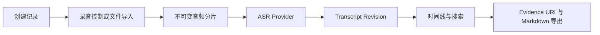

# LifeSub V0.1 首版可用产品

## 1. 产品目标

交付一个可在 macOS 本机运行的 LifeSub 基础版本，让用户完成“创建记录 → 导入或采集音频 → 获得可修订转写 → 按关键词和时间检索 → 定位并导出 Evidence”的完整闭环。

## 2. 首版范围

- 录音会话支持开始、暂停、恢复、停止的明确状态机。
- 支持音频文件导入，并按不可变 Physical Audio Chunk 登记来源与校验值。
- 提供可替换的 ASR Provider 边界；首版内置演示转写 Provider，真实模型可后续接入。
- 原始 ASR 与人工修订均保存为不可变 Transcript Revision。
- 时间线展示记录、来源、处理状态、片段与 Evidence 状态。
- 支持关键词搜索、记录筛选、片段详情和 Evidence URI 解析。
- 支持将当前 revision 导出为可重建 Markdown。
- 所有数据默认保存在本机应用数据目录。

## 3. 首版交付边界

真实 macOS 系统音频与麦克风双路采集通过独立 Capture Adapter 接口隔离。首版保证会话控制、导入、Evidence Core 与完整管理体验可运行；需要系统签名、录屏权限和设备权限的原生采集适配器不阻塞基础版本交付。

## 4. 核心流程

## 5. 验收标准

- [ ] 用户能创建、暂停、恢复并停止记录，非法状态切换被拒绝。
- [ ] 用户能导入音频文件，原文件不会被覆盖，Chunk 保存 hash 与来源。
- [ ] 每次转写或人工编辑都创建新 revision，原始 revision 保留。
- [ ] 用户能按关键词找到片段并看到准确时间范围与来源。
- [ ] Evidence URI 可解析到记录、片段或音频范围。
- [ ] 当前记录可导出 Markdown，并包含稳定 ID、revision 与内容 hash。
- [ ] 桌面界面具备时间线、记录详情、搜索、导入、录音状态和设置入口。
- [ ] 单元测试、界面测试、Rust 测试和生产构建全部通过。
